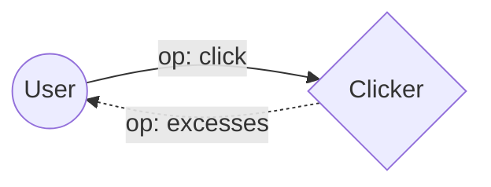
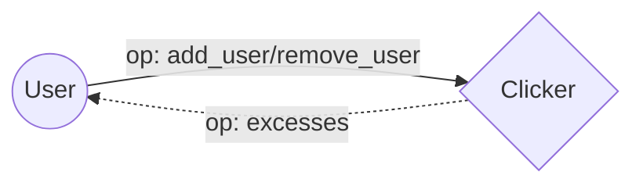
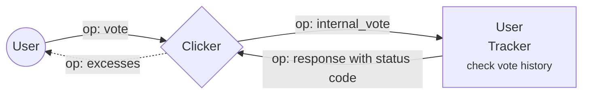
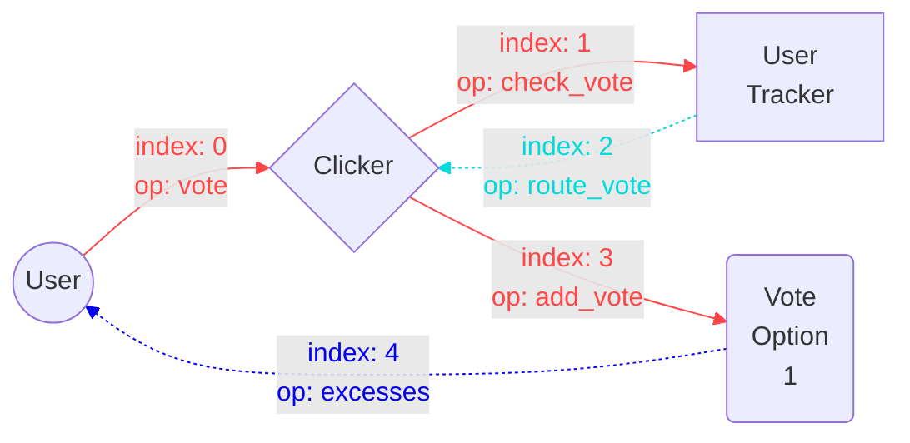
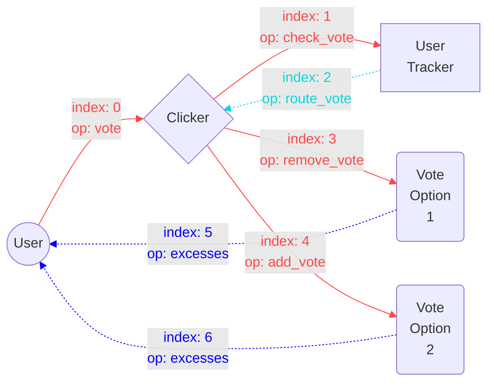

## Task 3

#### click op

#### add_user/remove_user op

## Task 4

I have changed the workflow a little so that I can re-use it in the task 5.
vote_id, which is stored in the Tracker contract checks whether it's user's first vote(vote_id = 0 initially) or repetition (vote_id = new_vote_id), or change (vote_id != 0 && vote_id != new_vote_id)

## Task 5

The workflow of Task 5 is almost same as in the Task 4. Only difference is how vote history is stored.(whether in Clicker contract's dictionary or individual Vote contracts)

#### initial vote

#### change vote

